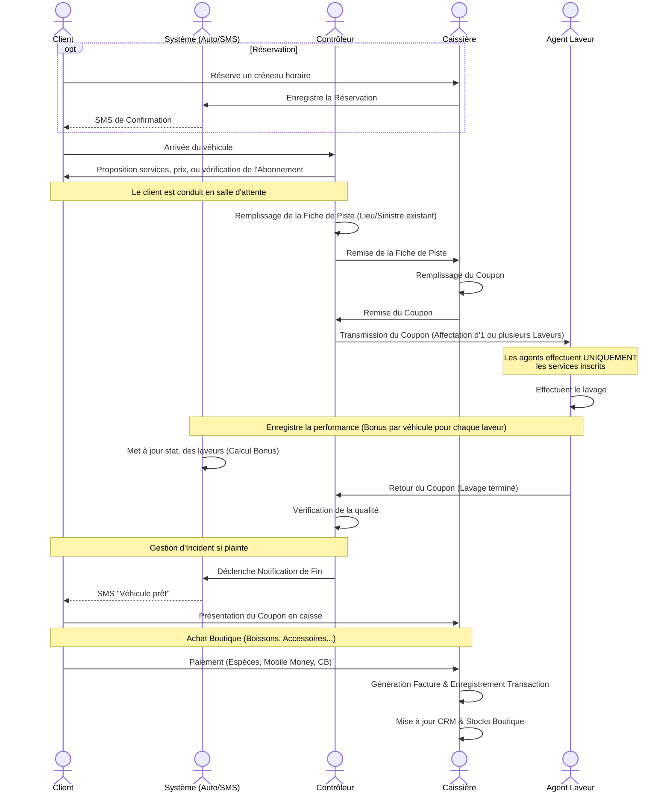
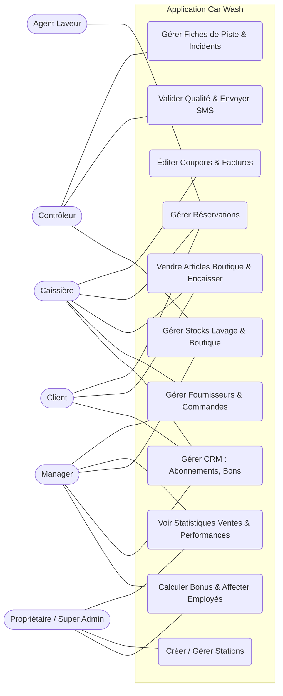
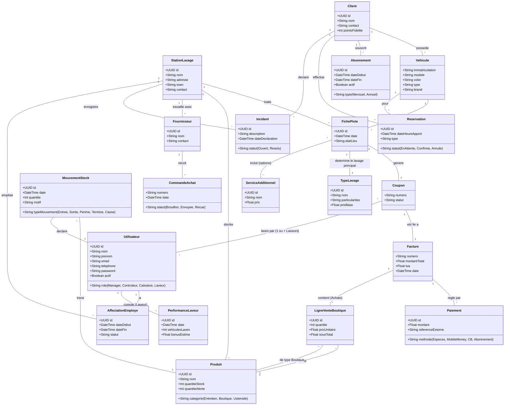

# Diagrammes UML - Application de Gestion de Car Wash

## 1. Diagramme de Séquence : Parcours Client (avec Réservations & Notifications)

## 2. Diagramme de Cas d'Utilisation

## 3. Diagramme de Classes (Complet)

